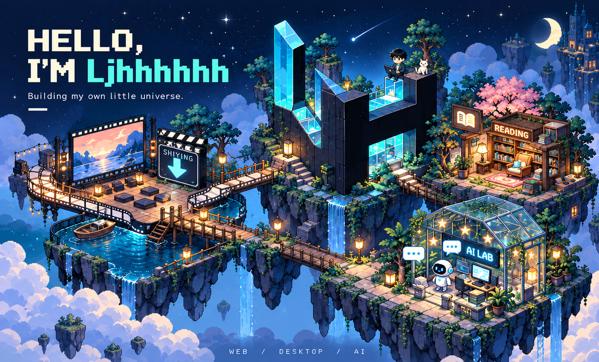
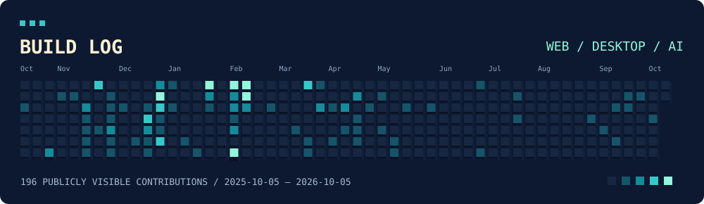

## 探索我的作品宇宙

从前端工程，到桌面工具与 AI 应用。点击岛屿，进入项目。

<table>
  <tr>
    <td width="50%" valign="top">
      
      <h3><a href="https://github.com/Ljhhhhhh/shiying-downloader">拾影院 · 拾影</a></h3>
      
拾影 · macOS / Windows 桌面视频下载器。

      Tauri · Rust · yt-dlp
    </td>
    <td width="50%" valign="top">
      
      <h3><a href="https://github.com/Ljhhhhhh/weread-drawer-macos">阅读书屋 · 微信读书抽屉</a></h3>
      
微信读书 · macOS 桌面边缘抽屉。

      Swift · WKWebView
    </td>
  </tr>
  <tr>
    <td width="50%" valign="top">
      
      <h3><a href="https://github.com/Ljhhhhhh/EchoSoul">AI 实验室 · EchoSoul</a></h3>
      
让对话映照内心的 AI 桌面应用。

      Electron · React · TypeScript
    </td>
    <td width="50%" valign="top">
      
      <h3><a href="https://github.com/Ljhhhhhh/h5vue">前端工坊 · h5vue</a></h3>
      
基于 Vue + Vant 的移动端脚手架。

      Vue · Vant · TypeScript
    </td>
  </tr>
</table>

## 开发足迹

每个方块代表一天，颜色越亮，贡献越多。数据来自 GitHub 公开贡献页面，每日自动更新。

## 工具箱

**前端工程** · TypeScript / Vue / React  
**桌面工具** · Tauri / Rust / Swift / Electron  
**AI 实践** · Python / Agent

---

<b>把想法变成工具，把实践留在代码里。</b> Building my own little universe.

